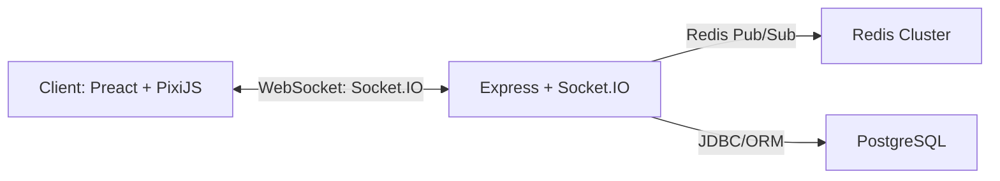

# RTS Pixel Game

Un petit jeu web multijoueur 2D (RTS simpliste) construit avec une stack moderne, scalable et solide.

---

## 🔥 Système de Combat Automatique

Les groupes de joueurs différents s'attaquent automatiquement lorsqu'ils entrent dans la portée (`ATTACK.RANGE`).

Nouvelle formule (simplifiée et entièrement proportionnelle) :

```
dégâts_par_seconde = attacker.pixelCount * PIXEL_DAMAGE_FACTOR
```

Chaque point de dégât supprime immédiatement un pixel (accumulation fractionnaire gérée : les fractions se cumulent d'un tick à l'autre).

Paramètres actuels :

```ts
ATTACK: {
   RANGE: 100,
   PIXEL_DAMAGE_FACTOR: 0.25, // 40 pixels => 10 pixels détruits / seconde
   MAX_PIXEL_LOSS_PER_TICK: 0, // 0 = sans limite
   // Champs legacy (désormais non utilisés) : BASE_DPS, DPS_PER_PIXEL, MIN_DPS
}
```

Suppression des groupes : dès que `pixelCount` tombe à 0, le groupe est marqué détruit et retiré au tick suivant.

Test local : `game-logic/src/test/combatSimulation.ts` peut être adapté pour la nouvelle formule.

---

## �📦 Tech Stack

* **Frontend**

  * **Vite** (build ultra-rapide, HMR)
  * **Preact + TypeScript** (UI légère pour menus, HUD, chat)
  * **PixiJS** (moteur 2D pour le rendu pixel)
  * **Socket.IO-client** (temps réel, WebSocket + fallback)

* **Backend**

  * **Node.js + Express** (serveur HTTP + WebSocket)
  * **TypeScript** (sécurité de typage)
  * **Socket.IO-server**
  * **Redis** (ioredis + `@socket.io/redis-adapter`) pour le scale-out
  * **PostgreSQL** (comptes, progression, logs)

* **Infra & CI/CD**

  * **Docker** & **Kubernetes** (EKS/GKE)
  * **Helm** (déploiement)
  * **GitHub Actions** (CI → build Docker → push & déploiement)
  * **Cloudflare** (CDN, WAF)
  * **Prometheus + Grafana** (metrics & alerting)
  * **Fluentd → Elasticsearch → Kibana** (logs)

---

## 📁 Structure du projet

```text
root/
├─ client/                  # Frontend Vite + Preact + PixiJS
│  ├─ public/
│  ├─ src/
│  │  ├─ assets/            # sprites, tuiles...
│  │  ├─ components/        # Preact UI (Lobby, HUD…)
│  │  ├─ core/              # boucle PixiJS (game.ts, renderer.ts)
│  │  ├─ net/               # Socket.IO client (socket.ts)
│  │  ├─ App.tsx
│  │  └─ main.tsx
│  └─ vite.config.ts
├─ server/                  # Backend Express + Socket.IO
│  ├─ src/
│  │  ├─ server.ts          # entrypoint + config Socket.IO
│  │  ├─ gameRoom.ts        # logique de simulation
│  │  └─ types.ts           # DTO partagés client/serveur
│  ├─ Dockerfile
│  └─ tsconfig.json
├─ infra/                   # K8s manifests & Helm charts
├─ .github/workflows/       # CI/CD
└─ README.md
```

---

## 🚀 Installation & développement

1. **Cloner le dépôt**

   ```bash
   git clone git@…:your-org/rts-pixel-game.git
   cd pixel-legion
   ```

2. **Installer et lancer le backend**

   ```bash
   cd server
   npm install
   # Configurer les variables d'environnement dans `.env` (REDIS_HOST, PG_HOST, etc.)
   npm run dev
   ```

3. **Installer et lancer le frontend**

   ```bash
   cd ../client
   npm install
   # Définir `VITE_SERVER_URL=http://localhost:3000` dans `.env`
   npm run dev
   ```

4. **Démarrer Redis & PostgreSQL en local**

   ```bash
   docker run -d --name redis -p 6379:6379 redis
   docker run -d --name pg -e POSTGRES_PASSWORD=pass -p 5432:5432 postgres
   ```

---

## 🎯 Workflow WebSocket



## ✅ Déploiement production

1. **Containerisation**

   ```bash
   docker build -t pixel-legion-server:latest server/
   docker build -t pixel-legion-client:latest client/
   ```

2. **Push sur le registry** (ECR/GCR…)

3. **Déploiement avec Helm**

   ```bash
   cd infra/helm
   helm upgrade --install pixel-legion ./chart \
     --set image.server=pixel-legion-server:latest \
     --set image.client=pixel-legion-client:latest
   ```

4. **Autoscaling**

   * Configurer un HPA sur le déploiement `pixel-legion-server` (CPU/RAM)
   * Ajouter une `podAntiAffinity` pour répartir la charge

5. **Supervision & logs**

   * Dashboards Grafana (ticks/sec, connexions WS, nombre de rooms)
   * Alerts sur latence WS et erreurs 5xx

---

## 🤝 Contribution

1. Fork & clone le dépôt
2. Créer une branche feature
3. Ouvrir une PR vers `develop`
4. Vérifier que la CI (lint et tests unitaires) passe
5. Merge & déploiement automatique sur `staging`

---

## 📄 Licence

MIT © VIRGILI Marc
